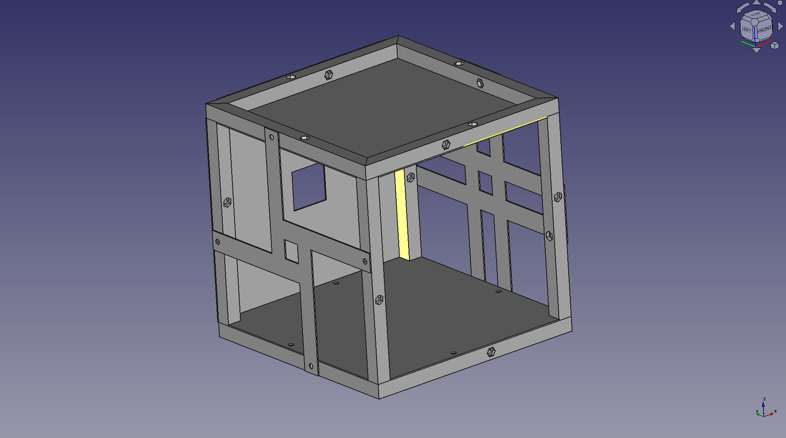
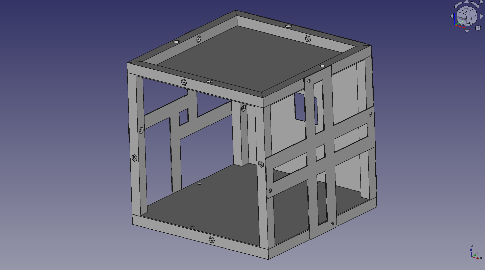

Cube Frame
==========

The Cube Frame is a platform on which to form customized storage containers.

The following images show a configuration that demonstrates some of the benefits of the Cube Frame, most notably
1. Modular, customizable panels
2. Capability of vertical mounting - You can tie things to the sides and save space!

Use the holes to fasten the panels to the Cube Frame with 1/4"-20 bolts and hex nuts.

Ain't that pretty?

