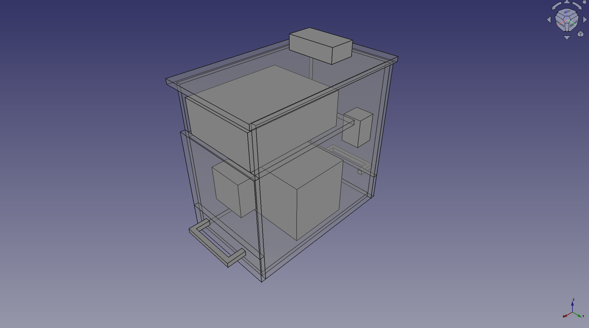
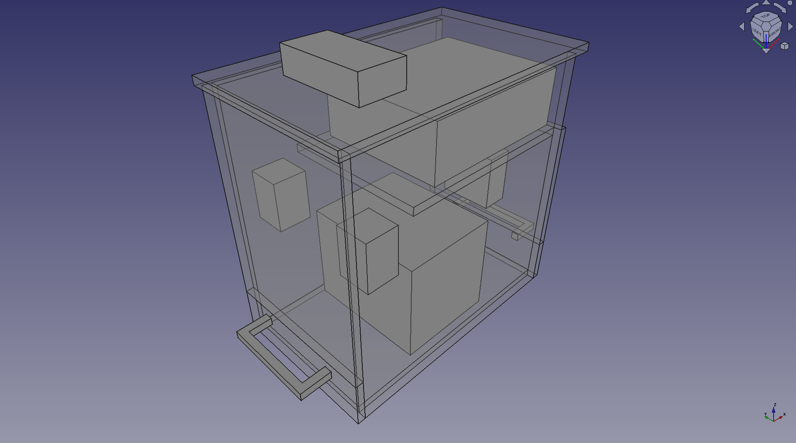

Solar Charger Box
=================

The Solar Charger Box is a deconstructable container tailor made for a solar charging system:
* 12V battery (LiPO4)
* 1500W DC to AC Inverter
* Solar Charge Controller
* Breakers for charge and inverter circuits
* Connectors to standard 12V solar panel
* USB-powered fans

Most of it bought cheaply online.

NOTE: I didn't go through the whole thing about modeling every hole and fastener. Might do it one day, but so far, it's just to get the
idea across.

Here it is! Translucent parts are wood. Solid parts are main components.

Front:

Back:

